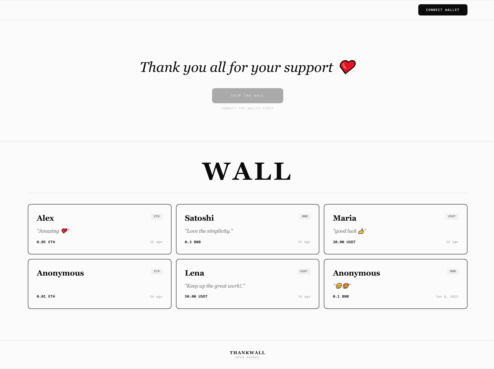
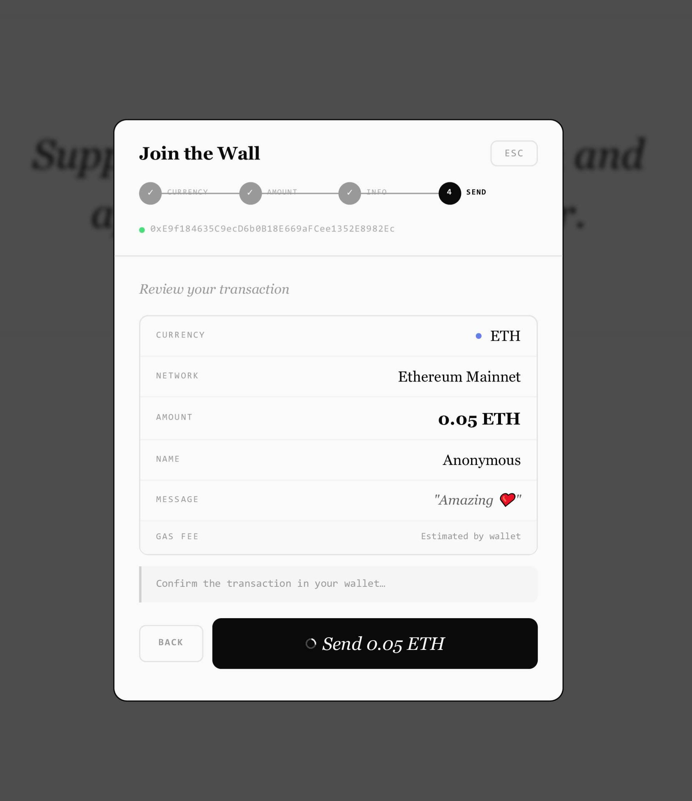
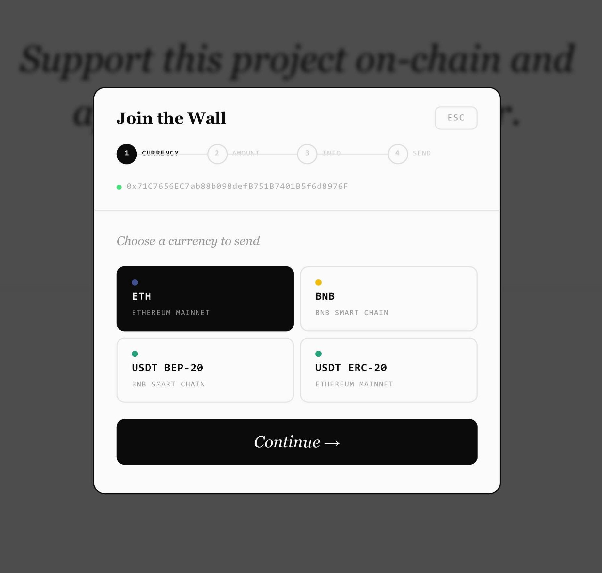

# ThankWall

**A self-hosted way to receive support/donations, with a public wall**

 

  

&nbsp;&nbsp;

  

## Deploy in one click

New to this? [SETUP.md](SETUP.md) walks through getting each variable, step by step.

---

**Environment Variables**

| Variable | Required |
|----------|----------|
| `REOWN_PROJECT_ID` | Yes |
| `UPSTASH_REDIS_REST_URL` | Yes |
| `UPSTASH_REDIS_REST_TOKEN` | Yes |
| `ADDRESS_EVM` | Yes |
| `DESCRIPTION` | No |
| `MIN_ETH` | No |
| `MIN_BNB` | No |
| `MIN_USDT` | No |

---

**How to get each variable**

- **`REOWN_PROJECT_ID`** — Create a project at [dashboard.reown.com](https://dashboard.reown.com) and copy the Project ID
- **`UPSTASH_REDIS_REST_URL`** — Create a free Redis database at [console.upstash.com](https://console.upstash.com)
- **`UPSTASH_REDIS_REST_TOKEN`** — Found in the same Upstash database dashboard
- **`ADDRESS_EVM`** — Your EVM-compatible wallet address (`0x…`) — all supported currencies send to this address
- **`DESCRIPTION`** — A short text that appears at the top of your wall
- **`MIN_ETH`** — Minimum ETH amount enforced before a supporter can send
- **`MIN_BNB`** — Minimum BNB amount enforced before a supporter can send
- **`MIN_USDT`** — Minimum USDT amount enforced before a supporter can send

___

**Supported currencies**

| Currency       | Network              |
|----------------|----------------------|
| ETH            | Ethereum Mainnet     |
| BNB            | BNB Smart Chain      |
| USDT (BEP-20)  | BNB Smart Chain      |
| USDT (ERC-20)  | Ethereum Mainnet     |